# Lumio

> 一个把 **Obsidian 笔记库** 直接同步成博客 + 公开知识库的系统。
> 围绕 [`fast-note-sync`](../fast-note-sync) 的同步层构建，前端是静态站，后台是单页应用。
>
> **特别为 AI agent 友好而设计**：CLI 一等公民、MCP server、Webhook、纯文件存储、原子写入。

设计稿（高保真，浅 / 深 / 跟随系统三档主题）见本仓库的 `index.html`。
线框版（白纸黑笔风）在 `wireframes.html`。

> 站点示例数据用的是 `LumioGames`（作者本人的游戏品牌）。代码里 `LumioGames` 是 sample author，
> `Lumio` 是项目本身。

---

## 设计稿一览

### 🌐 前台

| 页面 | 截图 |
|---|---|
| **首页** — Hero 动画 + 三栏目录（按月 / 按标签 / 笔记） |  |
| **文章详情** — 进度条 / 代码块 / Mermaid / KaTeX / 反向链接图 | 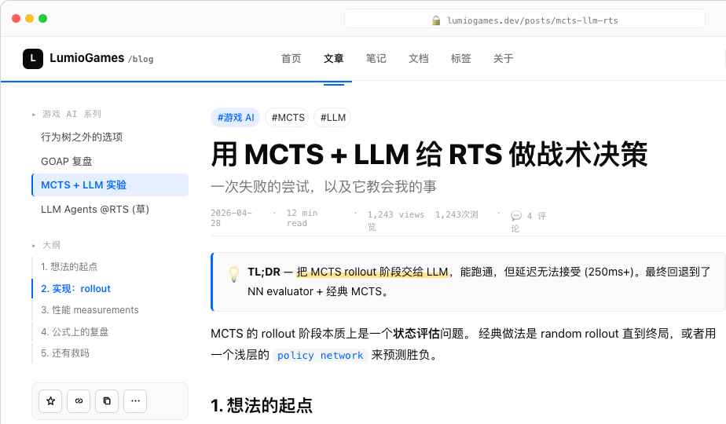 |
| **关于 / Now / Contact** — 三栏个人页 |  |
| **标签详情** — `#游戏 AI` 按年份分组 | 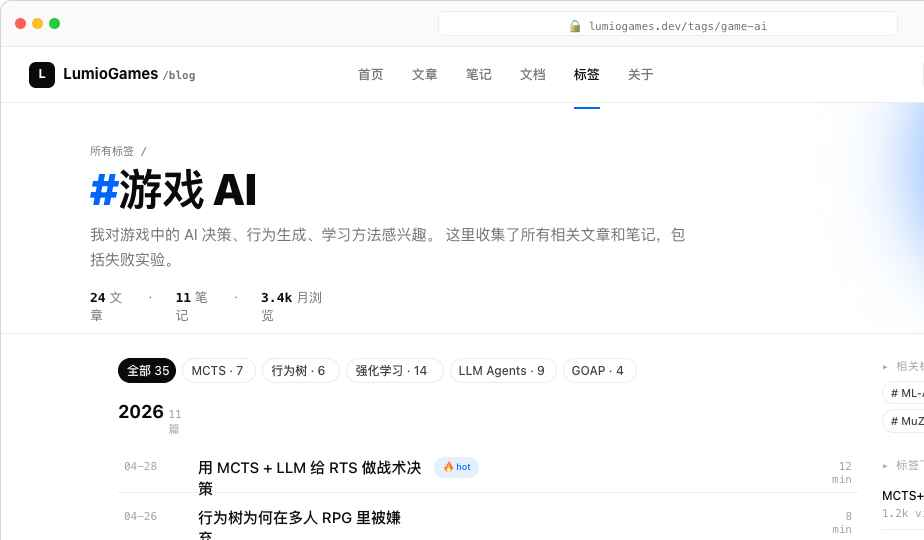 |
| **搜索结果** — 关键词高亮 / 类型筛选 / 时间过滤 | 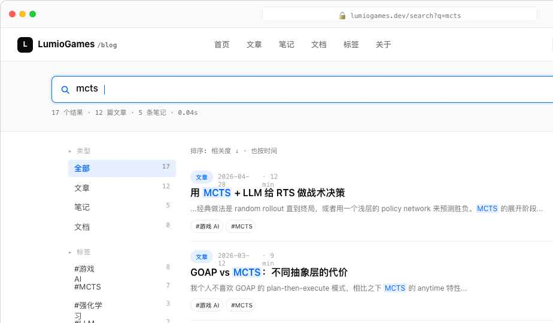 |
| **知识关系图** — 全屏 SVG / 集群图例 / 节点详情侧栏 | 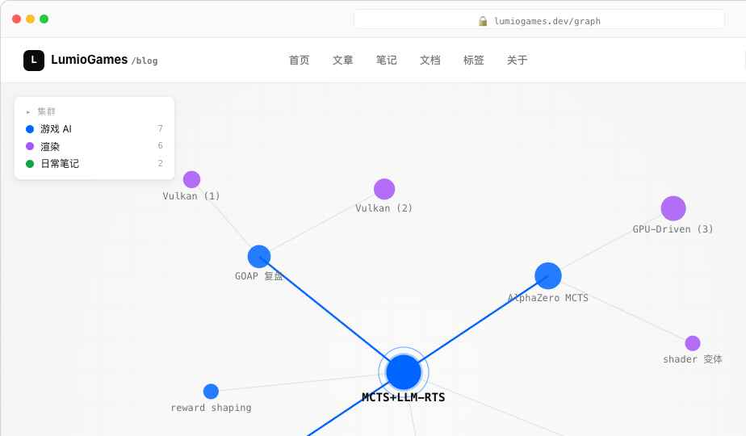 |
| **文章评论** — Giscus 风格，作者高亮气泡 | 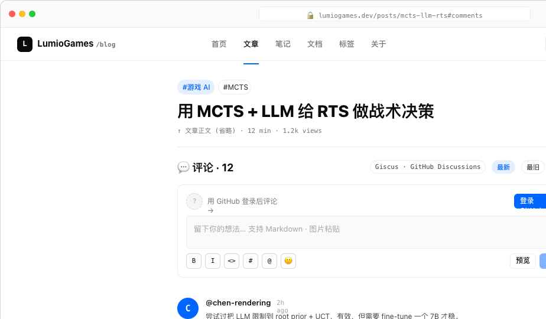 |
| **Newsletter 订阅** — Hero + 表单 + 往期回顾 |  |
| **RSS / Atom / JSON Feed** — 美化预览页 | 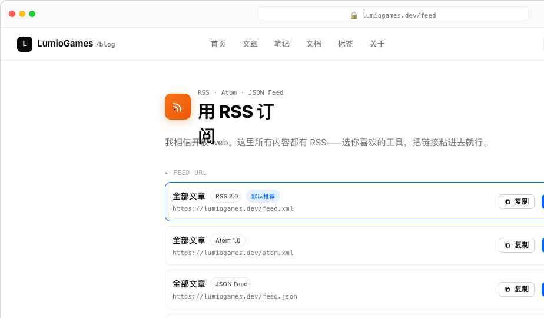 |
| **404 / 私有拦截** — 诊断面板告诉你为啥进不来 | 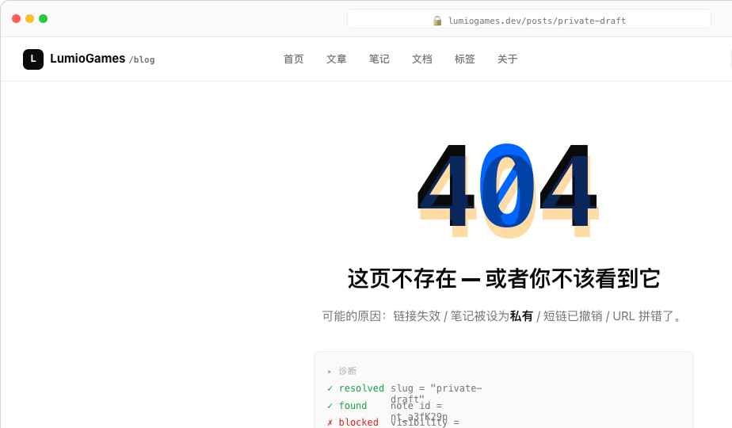 |

### ⚙️ 后台

| 页面 | 截图 |
|---|---|
| **仪表盘** — KPI / 趋势图 / Top 5 / 实时活动 |  |
| **单笔记详情** — 可见性 4 档 / 可搜索 / 短链 / 定时发布 | 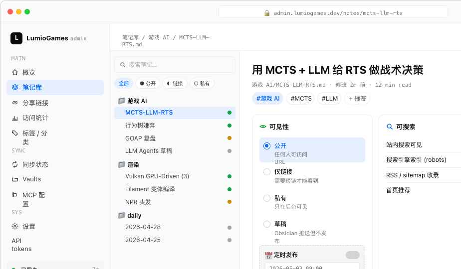 |
| **单篇 Analytics 钻取** — 流量、来源、留存 | 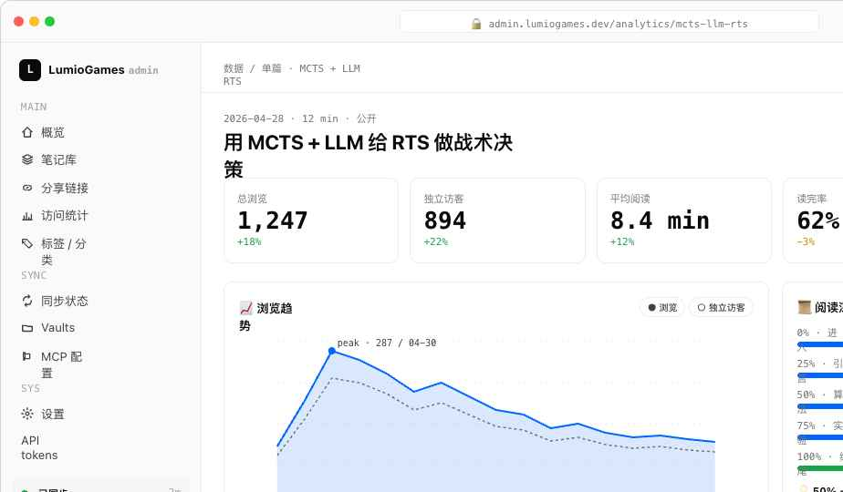 |
| **媒体库** — 网格 / 引用计数 / 选中状态栏 | 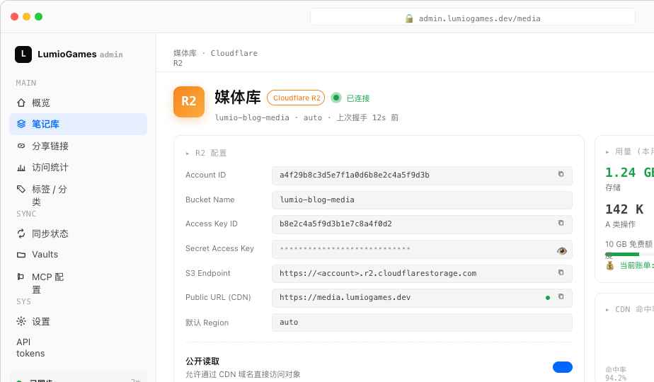 |
| **API tokens / Webhook** — 一次性显示 + 表格 | 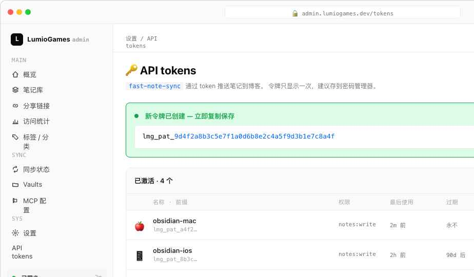 |
| **OG 图生成器** — 4 模板 + 社交平台预览 | 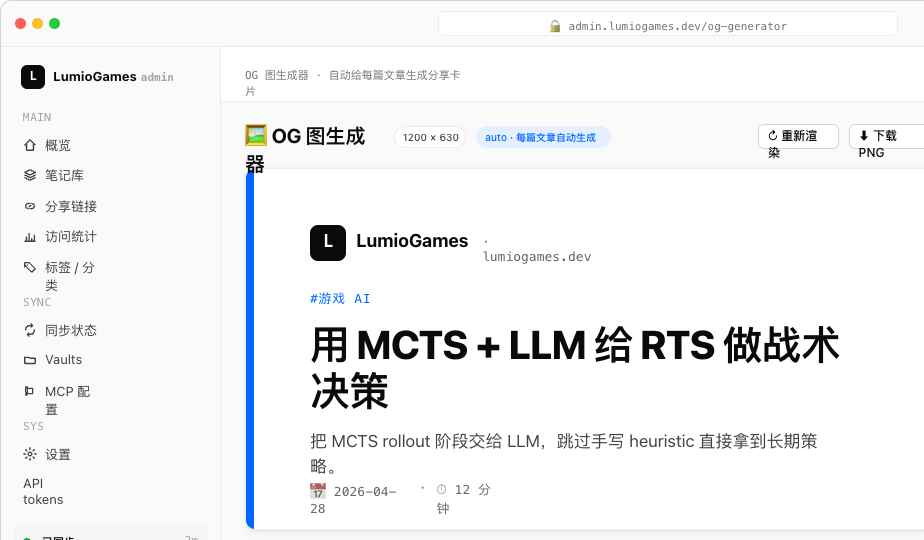 |
| **设置** — 站点 / 作者 / 外观 / SEO / 社交 | 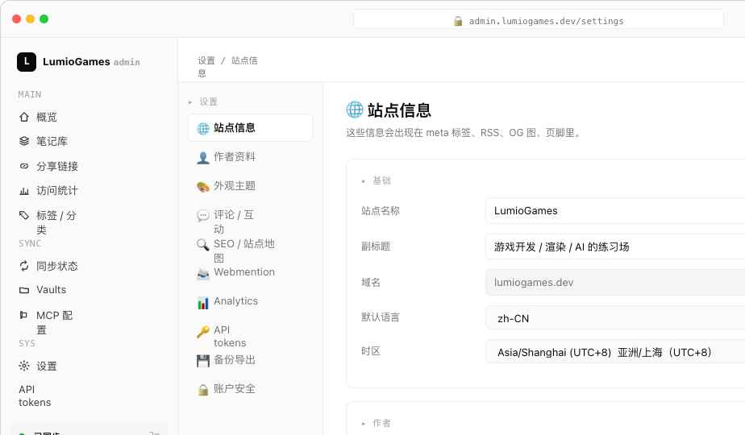 |

### 🤖 Agent / 开源

| 页面 | 截图 |
|---|---|
| **Blog CLI** — Agent 友好的命令行 + MCP | 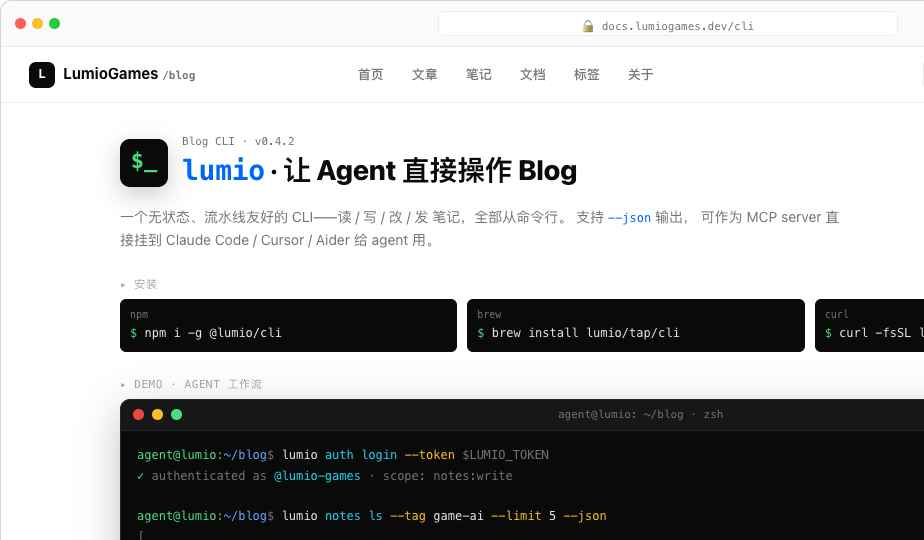 |
| **配置文件参考** — `config.yaml` / `features.yaml` / `.env` / frontmatter | 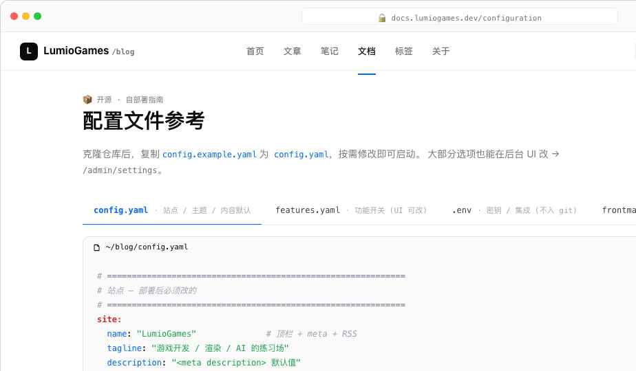 |

### 📱 移动端

| 首页 | 文章 | 后台笔记 | 设置 |
|---|---|---|---|
|  | 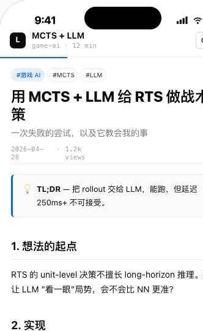 | 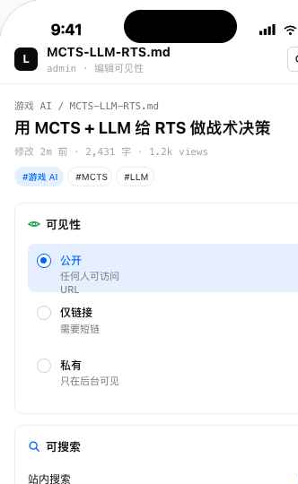 |  |

---

## 核心设计决策

### 1. 笔记 = 一等公民

不分博客文章和"小笔记"。一切都是 Markdown 文件，区别只在 frontmatter：

| 字段 | 说明 |
|---|---|
| `visibility` | `public` / `unlisted` / `link-only` / `private` |
| `searchable` | `true` 才会进入站内搜索索引 |
| `short_id` | `public` 和 `unlisted` 自动分配（如 `g7k2x`） |
| `scheduled_at` | 设了就是定时发布，未到时间在后台显示但不出现在前台 |
| `draft` | 草稿不进任何索引 |
| `tags`, `slug`, `title`, `summary` | 标准字段 |

可见性是**两个独立维度**：

- **谁能看** — 4 档 visibility
- **能不能搜到** — searchable 单独控制

为啥分开？因为 _"私下分享给朋友看，但不希望别人搜到"_ 是真实需求。

### 2. 短链层

每篇 `public` / `unlisted` 笔记自动有一个 5 字符短链：

```
lumio.games/n/g7k2x  →  lumio.games/posts/2025/mcts-llm-rts
```

短链是稳定的（即使你改了 slug 或 URL 结构）。后台可以查看、删除、批量管理。

### 3. Agent / CLI 一等公民

```bash
blog new "新文章标题"               # 创建草稿
blog visibility note.md unlisted   # 改可见性
blog publish --schedule "2d"       # 2 天后发
blog query "tag:游戏 AI && month:2025-04"  # JSON-Path 查询
```

加上 MCP server，Claude / Cursor / 各种 agent 都能直接调用。

### 4. 纯文件 + 增量构建

- 所有内容 = Obsidian vault 的 Markdown 文件
- `fast-note-sync` 监听变更，跑全量解析 + 渲染
- 输出是静态站点（HTML / RSS / JSON Feed / OG 图全在构建时生成）
- 数据库只用作搜索索引（可选 SQLite / Meilisearch）

后台 = SPA，对着同一份 SQLite 索引 + 文件系统读写。

---

## 主题系统

- 浅色：白底（#fff）+ Notion 灰调灰阶 + 蓝 accent（#0066ff）
- 深色：纯黑底（#0a0a0a）+ 中性灰阶 + 蓝 accent 调淡
- 跟随系统：`prefers-color-scheme` media query
- 字体：思源宋体 / Source Serif 4 — 正文；JetBrains Mono — 代码 & UI 细节

---

## 文件结构

```
index.html             # 主设计稿（design canvas，所有 artboard）
wireframes.html        # 低保真线框版
screenshot.html        # 单组件截图工具

app-hifi.jsx           # 主入口：设计画布装载 + 主题
design-canvas.jsx      # 画布组件（pan/zoom/focus）
tweaks-panel.jsx       # 右下角 Tweaks 面板

hf-shared.jsx          # 共享组件（Frame, Header, Footer, Tag, ...）
hf-home.jsx            # 前台首页
hf-article.jsx         # 文章详情
hf-admin.jsx           # 后台核心（仪表盘 / 笔记 / 设置 / 媒体 / Tokens / Analytics）
hf-extras.jsx          # 评论 / Newsletter / 搜索 / 标签 / 404 / 关系图
hf-extras2.jsx         # 关于 / RSS
hf-og.jsx              # OG 图生成器
hf-config.jsx          # 配置文件参考（开源用户文档）
hf-cli.jsx             # CLI / MCP 文档
hf-mobile.jsx          # 移动端
ios-frame.jsx          # iOS 设备框

styles.css             # 线框版样式
styles-hifi.css        # 高保真样式

doc/                   # 本目录
  README.md
  ARCHITECTURE.md
  FEATURES.md
  CONFIGURATION.md
  img/*.png
```

---

## 进一步阅读

- [`ARCHITECTURE.md`](./ARCHITECTURE.md) — 系统架构、数据流、构建管线
- [`FEATURES.md`](./FEATURES.md) — 完整功能清单
- [`CONFIGURATION.md`](./CONFIGURATION.md) — 配置文件字段参考
- [`CONTRIBUTING.md`](./CONTRIBUTING.md) — 贡献指南
- [`DEPLOYMENT.md`](./DEPLOYMENT.md) — 部署（Cloudflare / Docker / 多副本）
